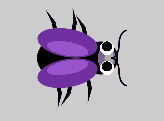
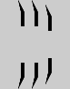
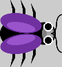

# Pixi.js Exercise

## Bug Simulator



1. Setup application
- Download project files and setup libraries
- Import the Pixi library and create an application with 800x600 resolution. Add the application's view to the page
- Create an empty `update` function that takes one number parameter `dt` and add it to the application's **Ticker**

2. Paint the background
- Create a `Graphics` element called `background` and fill an 800x600 rectangle using color **0xcccccc**
- Add the `background` element to the **Stage**
- Position it such that it covers the entire canvas

3. Create googly eyes
- Create a container called `eyes`
- Create a `Graphics` element called `sclera`. Fill in it two white circles with **radius 7** and their centers spaced **20** pixels apart. Add the element to the `eyes` container
  - **Note:** The bug initially points to the right of the screen (towards positive x-axis), so the left eye will be on top and the right - on the bottom
- Create two `Graphics` elements `leftPupil` and `rightPupil`. Fill a black circle with **radius 5** in each and add them to the `eyes` container
- Position the pupils such that they are centered in each sclera and resemble eyes
- Add the `eyes` container to the **Stage**


4. Animate the googly eyes
- Create a function `animateEyes` which takes a single number parameter `time`
- Inside the `animateEyes` function, create a statement that sets the value of the `position.y` property of each pupil using the following expression:

```original_y + Math.sin(time / 20) * 3```

- Create a number variable `elapsed` with initial value 0;
- Inside the `update` function, add a statement incrementing the value of `elapsed` with the value of the `dt` parameter
- Inside the `update` function, invike the `animateEyes` function, passing the `elapsed` variable as an argument

5. Create bug legs
- Create a container called `bug`
- Create a new `Texture` from the **legs.png** image file by using the `Texture.from()` Pixi method
- Set the anchor of the texture using its `defaultAnchor` property to **(1, 0.25)**
- Create an array `legs` with 6 sprites for each of the bug's legs, using the leg texture. Set the following properties:
  - All legs have rotation set to **Math.PI / 2**
  - For legs at indices 0, 1, 2, set the scale to **(0.3, 0.3)**
  - For legs at indices 3, 4, 5, set the scale to **(-0.3, 0.3)**
  - Positions for legs:
    - [0] (-25, -20)
    - [1] (-10, -20)
    - [2] (5, -15)
    - [3] (-25, 20)
    - [4] (-10, 20)
    - [5] (5, 15)
- Add all legs to the `bug` container
- Add the `bug` container to the **Stage**



6. Animate the legs
- Create function `animateLegs` which takes a single number parameter `time`
- Inside the `animateLegs` function, create a statement that sets the value of the `rotation` property of each leg using the following expressions:
  - For legs at indices 0, 2, 3, 5 -> ```(Math.PI / 2) + Math.sin(time / 5) * (Math.PI / 12)```
  - For legs at indices 1, 4 -> ```(Math.PI / 2) - Math.sin(time / 5) * (Math.PI / 12)```
- Inside the `update` function, invike the `animateLegs` function, passing the `elapsed` variable as an argument

7. Assemble the bug
- Create a `Sprite` element called `body` using the **bug.png** image file
- Set the scale of the `body` to **0.3**
- Set the rotation of the `body` to **Math.PI / 2**
- Set the position of the body to **(45, -30)**
- Add the `body` to the `bug` container
- Set the position of the `eyes` to **(25, 0)** and add it to the `bug` container
  - **Note:** Don't forget to delete the code that adds the `eyes` to the **Stage**



8. Factory functions
- Create a new file `bugFactory.ts`
- Create a function `addLegs` which takes a single parameter `bug` of type `PIXI.Container`
  - Move the code for generating the legs to this function
  - It adds the generated content to the passed in `bug` container
  - The function returns an array of the six legs
- Create a function `addBody` which takes a single parameter `bug` of type `PIXI.Container`
  - Move the code for generating the bug's body to this function
  - It adds the generated content to the passed in `bug` container
  - The function has no return value
- Create a function `addEyes` which takes a single parameter `bug` of type `PIXI.Container`
  - Move the code for generating the eyes, sclera and pupils to this function
  - It adds the generated content to the passed in `bug` container
  - The function returns an array with two elements: the left and right pupils

9. Bug class
- Create a new file `Bug.ts` and create a class `Bug` in that file
- It has properties:
  - `container` of type `PIXI.Container`
  - `legs` an array of `PIXI.Sprite`
  - `pupils` an array of `PIXI.Graphics`
  - `speed` of type number
- The class has methods:
  - Getter `position` returning its `container.position` internal property
  - Getter and setter `direction` returning and assigning the value of its `container.rotation` internal property
  - `animateLegs` - move the code from the origianl `animateLegs` function here and make it operate on the internal `legs` property
  - `animateEyes` - move the code from the origianl `animateEyes` function here and make it operate on the internal `pupils` property
- The constructor of the class takes four number parameters `x`, `y`, `direction` and `speed`
  - It assigns a new `PIXI.Container` to its `container` property
  - It invokes the factory functions `addLegs`, `addBody` and `addEyes`, passing in a reference to its `container` property and storing the returned values in its `eyes` and `legs` properties
  - It sets the position and rotation of its `container` to the passed in values
  - It assigns the passed in `speed` value to its internal `speed` property

10. Code cleanup
- Inside the file `app.ts`, create a new instance of Bug with position **(400, 300)** and direction and speed both 0
- Add the bug's `container` to the **Stage**
- Modify the `update` function so that it calls the methods `animateEyes` and `animateLegs` from the `bug` instance

11. **(BONUS)** Make the bug move
- Set the direction and speed of the bug to be non-zero (try with **Math.PI / 4** and **2** and adjust to your preference)
- Add a `velocity` property to the bug with `x` and `y` properties
- Calculate the starting `velocity` using:
```javascript
// Velocity equations
velocity.x = bug.speed * Math.cos(bug.direction)
velocity.y = bug.speed * Math.sin(bug.direction)
```
- Modify the `update` function so that it alters the bug's `position` depending on its `velocity`
- When the bug hits a wall, change its velocity by reflecting either the `x` or `y` component
- Calculate and set the bug's direction using the following equation:
```javascript
// Direction equation
bug.direction = Math.atan2(velocity.y, velocity.x)
```

12. **(BONUS)** Make the movement erratic, like a real bug
- Add random oscillations to the direction
- When the bug hits a wall, pick a new random direction
- Velocity should be racalculated each time using the Velocity equations